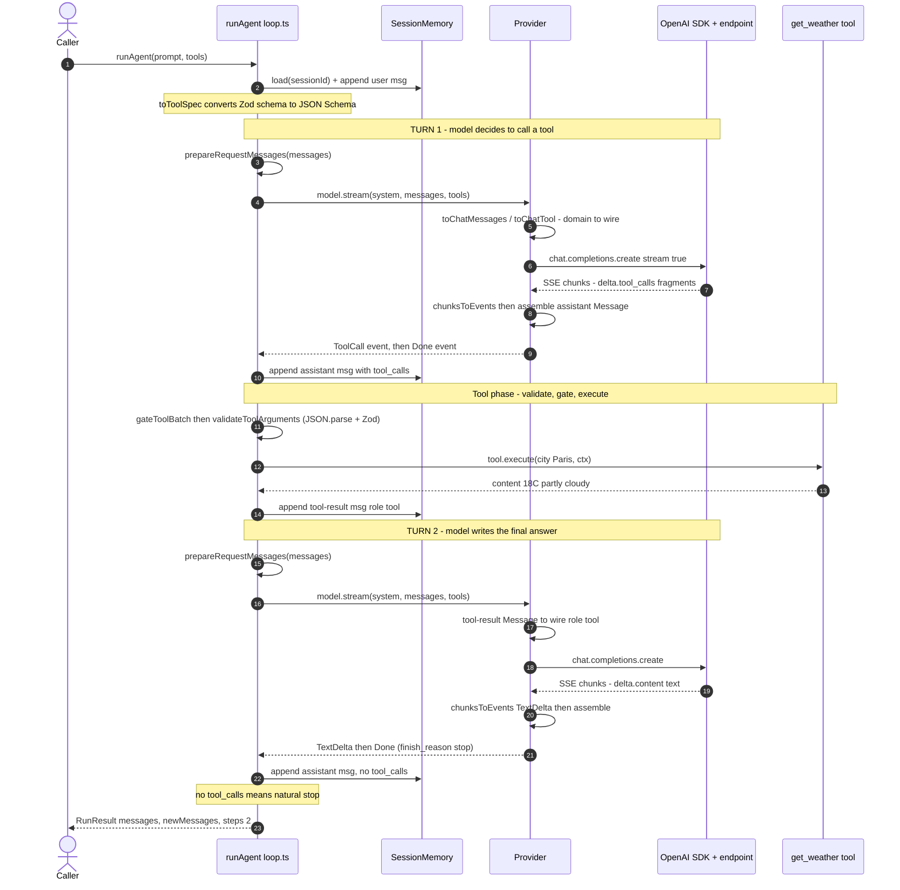

# Message Transformation Pipeline

How a turn travels from your domain types, out to an OpenAI-compatible endpoint,
and back — traced with a concrete "what's the weather?" example.

## The two type worlds

Everything in the loop is expressed in **provider-agnostic domain types**
(`agent-loop-core/types/`). The provider is the only place those get translated to
and from the **OpenAI chat-completions wire shape**. The seam is deliberately thin:

| Domain type (ours) | Wire type (OpenAI SDK) | Where it's converted |
| --- | --- | --- |
| `Message` | `ChatCompletionMessageParam` | `toChatMessage` (out) / `assemble` (in) |
| `ToolSpec` | `ChatCompletionTool` | `toChatTool` (out) |
| `StreamEvent` | `ChatCompletionChunk` (delta) | `chunksToEvents` (in) |
| `FinishReason` | wire `finish_reason` string | `mapFinishReason` (in) |

- Domain types: [agent-loop-core/types.ts](agent-loop-core/types.ts), [agent-loop-core/model.types.ts](agent-loop-core/model.types.ts)
- The translation layer: [agent-loop-core/providers/openai-compatible.ts](agent-loop-core/providers/openai-compatible.ts)
- The driver that never sees the wire shape: [agent-loop-core/primitives/loop.ts](agent-loop-core/primitives/loop.ts)

The loop only ever depends on the `ModelClient` interface
([model.types.ts:148](agent-loop-core/model.types.ts#L148)). Swap the provider and the
entire conversion table above changes; the loop does not.

---

## Sequence diagram — "What's the weather in Paris?"

Assume a `get_weather` tool authored with `defineTool`
([tools.ts:46](agent-loop-core/tools/tools.ts#L46)), and a single `runAgent` call.
The run takes **two model turns**: turn 1 asks for the tool, turn 2 gives the
answer.



---

## Outbound: domain `Message[]` → OpenAI wire

Every model turn rebuilds the request from scratch.

1. **Seed history.** `runAgent` loads prior history from memory and appends the
   normalized prompt. `normalizePrompt` turns a bare string into a
   `{ role: "user", content }` message.
   — [loop.ts:283](agent-loop-core/primitives/loop.ts#L283), [loop.ts:653](agent-loop-core/primitives/loop.ts#L653)

2. **Reshape context (optional).** `hooks.transformContext(messages)` runs if
   provided — the seam for compaction/summarization.
   — [loop.ts:304](agent-loop-core/primitives/loop.ts#L304)

3. **Strip stale reasoning.** `prepareRequestMessages` drops `reasoning` /
   `reasoning_details` from assistant turns that did **not** call tools (the
   model ignores them there; thinking-mode models *require* them on tool-call
   turns). Returns a fresh array, so it doubles as the snapshot the model sees.
   — [loop.ts:403](agent-loop-core/primitives/loop.ts#L403)

4. **Tools → specs.** Each `Tool`'s Zod schema is converted to JSON Schema via
   `z.toJSONSchema` once per run.
   — `toToolSpec`, [tools.ts:71](agent-loop-core/tools/tools.ts#L71)

5. **Build `ModelRequest`** `{ system, messages, tools, signal }` and call
   `model.stream(request)`.
   — [loop.ts:307](agent-loop-core/primitives/loop.ts#L307)

6. **Domain → wire (the actual conversion).** Inside the provider:
   - `toChatMessages` prepends the system prompt, then maps each message.
     — [openai-compatible.ts:202](agent-loop-core/providers/openai-compatible.ts#L202)
   - `toChatMessage` switches on `Role`:
     - `user`/`system` → `{ role, content }`
     - `tool` → `{ role:"tool", tool_call_id, content }`
     - `assistant` → `{ role:"assistant", content }`, plus `tool_calls`
       (pass-through verbatim — already the wire shape) and reasoning re-attached
       as `reasoning_details` or flat `reasoning_content`.
     — [openai-compatible.ts:214](agent-loop-core/providers/openai-compatible.ts#L214)
   - `toChatTool` maps each `ToolSpec` → `{ type:"function", function:{ name, description, parameters } }`.
     — [openai-compatible.ts:252](agent-loop-core/providers/openai-compatible.ts#L252)
   - `chat_template_kwargs` (e.g. `{ enable_thinking, clear_thinking }`) is
     merged into the body for vLLM/Featherless templates.
     — [openai-compatible.ts:170](agent-loop-core/providers/openai-compatible.ts#L170)

7. **Fire.** `client.chat.completions.create(params, { signal })` opens the SSE
   stream. A setup failure becomes a single `Error` event instead of throwing.
   — [openai-compatible.ts:183](agent-loop-core/providers/openai-compatible.ts#L183)

---

## Inbound: SSE chunks → domain `Message`

8. **Chunks → events.** `chunksToEvents` walks the SDK's delta stream and emits
   `StreamEvent`s as data arrives:
   - `readReasoning(delta)` reads the non-standard `reasoning` /
     `reasoning_content` field → `ReasoningDelta`.
     — [openai-compatible.ts:376](agent-loop-core/providers/openai-compatible.ts#L376)
   - `accumulateReasoningDetails` folds structured `reasoning_details[]` blocks
     verbatim (signed/encrypted CoT) → `ReasoningDelta` for the display text.
     — [openai-compatible.ts:391](agent-loop-core/providers/openai-compatible.ts#L391)
   - `delta.content` → `TextDelta`.
   - `delta.tool_calls[]` arrives as **string fragments** of the JSON arguments;
     they're accumulated into `toolDrafts` keyed by index — not emitted until
     whole.
     — [openai-compatible.ts:337](agent-loop-core/providers/openai-compatible.ts#L337)
   - `mapFinishReason` maps the wire `finish_reason` → `FinishReason` enum.
     — [openai-compatible.ts:474](agent-loop-core/providers/openai-compatible.ts#L474)

9. **Assemble.** At stream end, `assemble(acc)` builds the assistant `Message`:
   content, flattened `reasoning`, verbatim `reasoning_details`, `tool_calls`
   (with `arguments` kept as the **raw JSON string** — the loop parses it later),
   `finishReason`, `timestamp`. Then one `ToolCall` event per call, then `Done`.
   — [openai-compatible.ts:495](agent-loop-core/providers/openai-compatible.ts#L495), [openai-compatible.ts:350](agent-loop-core/providers/openai-compatible.ts#L350)

10. **Events → one Message.** Back in the loop, `streamAssistant` consumes the
    events (re-emitting them as `AgentEvent`s for observers) and returns the
    assembled assistant `Message`, which is pushed to history and memory.
    — [loop.ts:420](agent-loop-core/primitives/loop.ts#L420)

---

## The return path: running the tool

11. **No tool calls ⇒ done.** If the assistant turn has no `tool_calls`, that's
    the final answer and the loop breaks.
    — [loop.ts:329](agent-loop-core/primitives/loop.ts#L329)

12. **Gate the batch.** `gateToolBatch` validates each call with
    `tryValidateToolArguments` and presents only well-formed calls to
    `hooks.gateToolCalls` (the permission seam) once, up front.
    — [loop.ts:474](agent-loop-core/primitives/loop.ts#L474)

13. **Validate + execute.** `executeOne` runs the wire → domain conversion for
    arguments: `validateToolArguments` does `JSON.parse` on the raw argument
    string, then Zod-validates it into a typed `ToolArguments` object. Then
    `beforeToolCall` → `tool.execute(args, ctx)` → `afterToolCall`.
    — [loop.ts:579](agent-loop-core/primitives/loop.ts#L579), `validateToolArguments` at [tools.ts:95](agent-loop-core/tools/tools.ts#L95)

14. **Result → Message.** The `ToolResult` becomes a `{ role:"tool", content,
    tool_call_id, toolName, isError }` message, appended to history and memory in
    original call order.
    — [loop.ts:637](agent-loop-core/primitives/loop.ts#L637)

15. **Loop.** Control returns to step 3. On the next turn, that tool-result
    message is converted by `toChatMessage`'s `Role.Tool` branch back to wire
    `{ role:"tool", tool_call_id, content }`, the model reads it, and turn 2
    produces the final answer.

---

## The weather example, stage by stage

**Caller**

```ts
await runAgent({
  model, memory, sessionId: "weather-demo",
  prompt: "What's the weather in Paris?",
  tools: [getWeatherTool],
});
```

**After step 3 — domain `messages` (turn 1 request):**

```jsonc
[ { "role": "user", "content": "What's the weather in Paris?" } ]
```

**After step 6 — OpenAI wire body sent to the endpoint:**

```jsonc
{
  "model": "deepseek-ai/DeepSeek-V4-Flash",
  "stream": true,
  "messages": [ { "role": "user", "content": "What's the weather in Paris?" } ],
  "tools": [ { "type": "function", "function": {
    "name": "get_weather",
    "description": "Get the current weather for a city.",
    "parameters": { "type": "object", "properties": { "city": { "type": "string" } }, "required": ["city"] }
  } } ]
}
```

**After step 9 — assembled assistant `Message` (turn 1 response):**

```jsonc
{
  "role": "assistant",
  "content": "",
  "tool_calls": [ { "id": "call_abc", "type": "function",
    "function": { "name": "get_weather", "arguments": "{\"city\":\"Paris\"}" } } ],
  "finishReason": "tool_calls"
}
```

Note `arguments` is still a **JSON string** here — it isn't parsed until step 13.

**After step 14 — tool-result `Message` appended:**

```jsonc
{ "role": "tool", "tool_call_id": "call_abc", "toolName": "get_weather",
  "content": "18°C, partly cloudy", "isError": false }
```

**After step 9 of turn 2 — final assistant `Message`:**

```jsonc
{ "role": "assistant", "content": "It's 18°C and partly cloudy in Paris right now.",
  "finishReason": "stop" }
```

No `tool_calls` ⇒ the loop breaks (step 11) and returns `RunResult { steps: 2 }`.

---

## File reference index

| Concern | File |
| --- | --- |
| Domain message vocabulary (`Message`, `Role`, `ToolCall`, `FinishReason`, `ReasoningDetail`) | [agent-loop-core/types/](agent-loop-core/types/) |
| Model boundary (`ModelClient`, `ModelRequest`, `StreamEvent`) | [agent-loop-core/model.types.ts](agent-loop-core/model.types.ts) |
| The agentic loop + `prepareRequestMessages` | [agent-loop-core/primitives/loop.ts](agent-loop-core/primitives/loop.ts) |
| Domain ⇄ OpenAI wire conversion (both directions) | [agent-loop-core/providers/openai-compatible.ts](agent-loop-core/providers/openai-compatible.ts) |
| Tool authoring + `toToolSpec` / `validateToolArguments` | [agent-loop-core/tools/tools.ts](agent-loop-core/tools/tools.ts) |
| Tool name → `Tool` resolver | [agent-loop-core/tools/registry.ts](agent-loop-core/tools/registry.ts) |
| History store (`load` / `append`) | [agent-loop-core/memory/session-memory.ts](agent-loop-core/memory/session-memory.ts) |
| Runnable end-to-end example | [examples/running-product.ts](examples/running-product.ts) |
</content>
</invoke>
