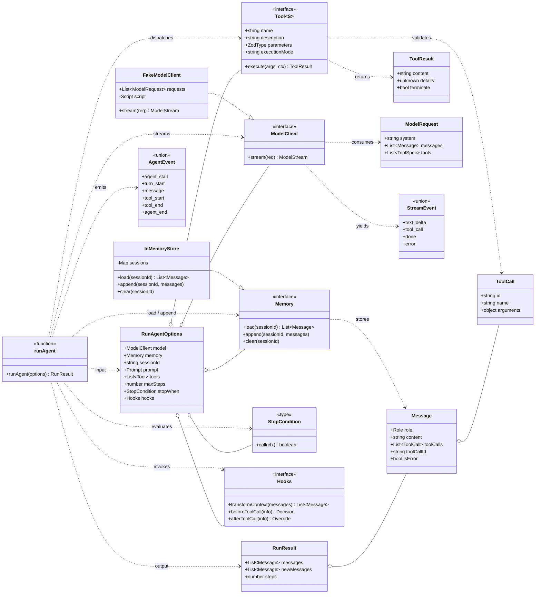
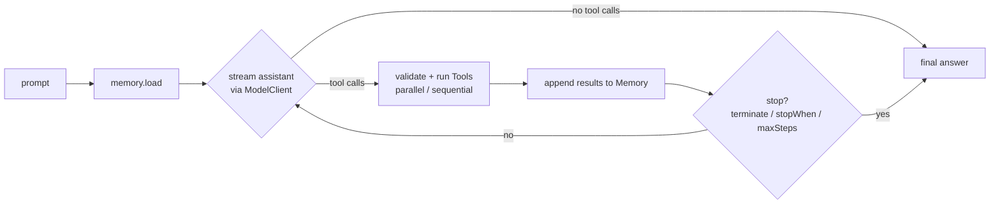

# agent-core — architecture

OOP view of the core. Every dependency points at an **interface** (`ModelClient`,
`Memory`, `Tool`, `StopCondition`, `Hooks`), which is what makes each piece
plug-and-play. `runAgent` is the orchestrator; it owns no concrete provider.

> GitHub renders the diagram below directly. For an interactive page, open
> [`architecture.html`](./architecture.html) in a browser, or paste the block
> into <https://mermaid.live>.

## Reading guide

- `..|>` **implements** — `FakeModelClient`/`InMemoryStore` are swappable
  implementations of their interfaces.
- `..>` **depends on / uses** — `runAgent` only ever depends on interfaces.
- `o--` **aggregates** — `RunAgentOptions` is the wiring point where you plug
  concrete implementations in.

## The runtime flow

