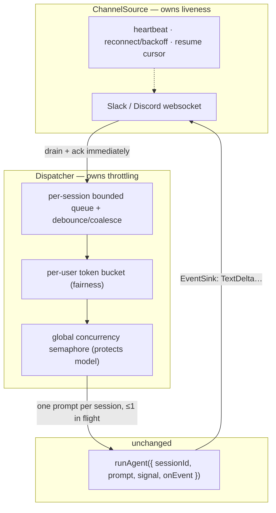

# Channels (live ingress: Slack, Discord, …)

> Status: design sketch, not yet built. This is a thinking document.

A channel like Slack or Discord is a **long-lived websocket that emits an
unbounded, bursty stream of inbound events**. `runAgent` is the opposite: a
request/response unit — one prompt, keyed by `sessionId`, that loops until a
final answer and persists to `Memory`. It has no notion of "always on."

So we do **not** make `runAgent` listen to a socket. We build a layer in front
of it that turns a continuous stream into discrete, rate-controlled runs. That
layer is the missing component, and `runAgent` itself doesn't change.

## The core tension: two backpressure domains

The "spam could overwhelm the model" worry is really two different rate domains
that must stay **decoupled**:

| Domain | Rate | If you stall it… |
|---|---|---|
| Transport (the websocket) | high, must drain continuously | Slack/Discord miss your heartbeat acks and **disconnect you** |
| Consumer (the model) | low, expensive, rate-limited | provider 429s, cost blowup |

If you call `runAgent` directly from the socket's `onMessage` — or stop reading
the socket while a run is in flight — you couple the two, and the transport side
loses (dropped connection, missed messages).

**The fix is a queue between them that acts as an impedance matcher.** Always
drain and ack the socket immediately; apply backpressure at the queue, never at
the socket. "Keep the channel alive" and "don't overwhelm the model" become two
separate jobs that never block each other.

## Components

### 1. `ChannelSource` — a new transport seam (analogous to `ModelClient`)

A plain interface in the same composition-over-inheritance style as the existing
seams. It owns **only** transport concerns:

- connect / disconnect, **heartbeat ping-pong, reconnect with exponential
  backoff, resume cursors** — this is what "keep the channel alive" actually
  means, and it lives entirely here, never touching the model
- normalize provider events (Slack event API vs Discord gateway) into a single
  `InboundMessage { channelId, threadId, userId, text, … }`
- map `channel/thread → sessionId`, so a thread becomes a `runAgent`
  conversation for free and the existing `Memory` Just Works
- send replies back out, driven by the existing `EventSink` — stream
  `TextDelta` events to the channel

`SlackSource` / `DiscordSource` are implementations, exactly like
`OpenAICompatibleModel` implements `ModelClient`. Liveness is its sole job and it
does that job regardless of how backed-up the model is.

### 2. A session-keyed **dispatcher** with a bounded queue

This is the heart of the throttling story. The source pushes normalized messages
into the dispatcher; the dispatcher decides *when* a run happens. Properties, in
priority order:

- **Per-session serialization.** At most **one in-flight `runAgent` per
  `sessionId`.** Not optional given the memory model: two concurrent runs on the
  same `sessionId` would interleave their `memory.append` calls and corrupt the
  history. A per-session lock/queue gives correct ordering for free.
- **Debounce / coalesce bursts.** When a user fires 5 messages in 2 seconds,
  don't launch 5 runs. Buffer for a short window (e.g. 500 ms–1 s of quiet, or N
  messages) and fold them into **one prompt** — `runAgent` already accepts
  `Message[]`. This alone kills most "spam → model overwhelm."
- **Bounded queue + drop policy.** Each session's queue has a cap. On overflow:
  coalesce, drop-oldest, or reply "I'm catching up." This is the spam ceiling — a
  single abusive channel can't grow unbounded work.

### 3. Admission control — two layers of rate limiting

- **Per-user / per-channel token bucket** (fairness / anti-spam): one loud user
  can't starve everyone else.
- **Global concurrency cap** (a semaphore / worker pool): the max number of
  `runAgent` calls running at once across *all* sessions. This is what actually
  protects the model and the provider rate limit; excess waits in queue.
  Conceptually the same idea as `ExecutionMode.Sequential` — a deliberate cap on
  parallelism — applied across sessions instead of within one run.

### 4. Cancellation — the primitive already exists

`runAgent` takes an `AbortSignal`. Wire a per-session `AbortController` into the
dispatcher so a policy like "newer message supersedes the in-flight run" can
cancel the stale run instead of queueing it — a big lever for not spending model
calls on stale context.

## How it fits together

The load-bearing property: **`runAgent` does not change.** The new code is
`ChannelSource` (a seam, multiple impls) plus the dispatcher (the queue/throttle
policy). Memory, `signal`, and the event sink are all reused as-is.

## Open questions

- **Coalescing window**: fixed debounce vs. quiet-period vs. max-batch-size — or
  adaptive to load?
- **Overflow policy**: drop-oldest vs. coalesce vs. user-visible "catching up"
  — probably per-channel config.
- **Supersede vs. queue**: when a new message lands mid-run, cancel or finish?
  Likely a policy flag, defaulting to finish for short runs.
- **Session granularity**: per-thread vs. per-channel vs. per-user `sessionId`
  mapping — affects how memory and context accumulate.
- **Fairness vs. throughput**: does the global semaphore need per-tenant quotas,
  or is a single global cap enough for v1?
