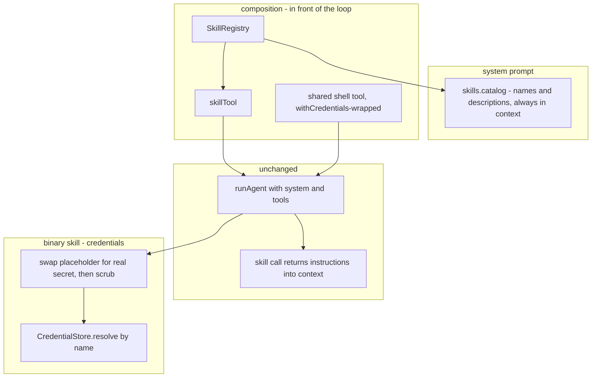

# Skills (bundled instructions + tools, with progressive disclosure)

> Status: the seam (`Skill`, `SkillRegistry`, `skillTool`) is **built and
> tested** — see [`agent-core/skills/`](../skills/) plus the runnable
> [`hello-skill`](../../examples/hello-skill.ts) and
> [`secret-hello-skill`](../../examples/secret-hello-skill/secret-hello-skill.ts).
> Credentials for binary skills work **today** via placeholder-swap; the `env`
> hardening (`ProcessBackend`) and the `skillGate` are still design-only. The
> rest of this stays a thinking document for what remains.

A **skill** is a named bundle of three things the agent can pull in on demand:

- **description** — a one-line summary, cheap, kept in context every turn so the
  model can decide *when* the skill applies;
- **instructions** — the full how-to body, expensive, injected into context
  **only when the skill fires** (progressive disclosure);
- **tools** — the capabilities the skill contributes to the run.

This is the same shape as a Claude Code skill. It maps cleanly onto seams we
already have: description → a line in the `system` catalog; instructions → lazy
injection; tools → the existing `Tool` seam. The load-bearing property, exactly
as with `ToolRegistry` and the channels sketch: **`runAgent` does not change.**
Everything here is composition in front of the loop.

## The core idea: disclosure is just a tool result

The only genuinely new mechanism a skill needs is *lazy injection of its
instructions* — and the loop already gives that away for free. A tool's
`ToolResult.content` is folded into the conversation. So "reveal this skill's
instructions on demand" is just a built-in tool whose `execute` returns the
skill body. The model reads the catalog, calls `skill({ name })` when it decides
a skill is relevant, and the instructions flow back into context as that call's
result. No loop change, no new runtime concept.

The expensive part (instructions, often long) is disclosed lazily; the cheap
part (descriptions) is always visible. That is the whole win.

## Components

### 1. `Skill` — the bundle (a plain interface, like `Tool`)

```ts
export interface Skill {
  /** Unique name; advertised in the catalog, invoked by the skill tool. */
  name: string;
  /** One-line summary the model reads to decide relevance. Always in context. */
  description: string;
  /** Full how-to body. Injected into context ONLY when the skill is invoked. */
  instructions: string;
  /** Tools this skill contributes to the run. */
  tools?: Tool[];
}
```

### 2. `SkillRegistry` — name → skill, mirroring `ToolRegistry` one-to-one

A composition helper, **not** a loop dependency — the same stance as
`ToolRegistry`. Duplicate-name `register` throws; unknown-name `resolve` throws
and lists what's available (fail fast, per the project's error rule).

```ts
class SkillRegistry {
  register(skill: Skill): this
  get(name: string): Skill | undefined
  list(): Skill[]
  resolve(names: string[]): Skill[]
  catalog(): string   // "- name: description" lines for the system prompt
  tools(): Tool[]     // flatten every skill's tools
}
```

### 3. `skillTool(registry)` — the disclosure mechanism

A built-in factory in the existing convention (`searchTool(backend)`,
`scratchpadTools(store)` → `skillTool(registry)`):

```ts
function skillTool(registry: SkillRegistry): Tool
//   execute({ name }) -> { content: registry.get(name).instructions }
//   unknown name      -> throw  (loop turns it into an isError result listing skills)
```

### Wiring — pure composition, no loop change

```ts
const skills = new SkillRegistry([codeReviewSkill, deploySkill]);

await runAgent({
  ...opts,
  system: `${baseSystem}\n\n## Available skills\n${skills.catalog()}`,
  tools: [skillTool(skills), ...skills.tools(), ...otherTools],
});
```

The model sees the catalog every turn; when it calls `skill({name})`, the
instructions arrive as that tool's result and it proceeds with the skill's tools
already in hand. This is how Claude Code's own Skill tool behaves.

## The one open decision: are a skill's tools gated?

Whether a skill's **tools** are callable immediately, or hidden until the skill
fires:

| | Tools always registered (v1) | Tools gated until invoked |
|---|---|---|
| Loop changes | none | none — reuses the `gateToolCalls` hook |
| Complexity | trivial | adds an activation-tracking guard |
| Tradeoff | all skill tool *specs* always advertised | true progressive disclosure of tools too |

Ship the left column first — instructions are the expensive part and you get
lazy disclosure of those immediately. The gate is a natural second increment
because `gateToolCalls` is already the single admission point: a
`skillGate(skills, activeState)` decorator blocks a skill's tools until its
`skill()` call has run, and `runAgent` is still untouched.

## When a skill is a *binary*: credentials

A skill that wraps a CLI (`gh`, `glab`, a vendored binary) is the **typical**
case, and it ships *no tools of its own*. It is pure instructions that drive the
one shared `shell` tool:

> "To greet someone, run `SECRET_HELLO_TOKEN={{secret_hello_token}} secret-hello Ada`."

Credentials ride the mechanism that **already exists** — `withCredentials`, the
placeholder swap. Wrap the shared shell tool once:

```ts
const shell = withCredentials(shellTool(backend), store);
```

Now `{{secret_hello_token}}` in any command is swapped for the real secret the
instant before the command runs, and scrubbed back out of the result. The model
and the transcript only ever see the placeholder. **No `ProcessBackend`, no
per-skill tool, no loop change** — a binary skill works today with the seam you
have. (The runnable
[`secret-hello-skill`](../../examples/secret-hello-skill/secret-hello-skill.ts)
and its [`secret-hello`](../../examples/bin/secret-hello) binary — which refuses
to run without the credential — prove it end-to-end.)

To also require human approval before each command, compose the same
credential-wrapped shell tool with the permission gate — both seams stack on the
shared shell tool without knowing about each other. See the
[Permissions & Credentials guide](../../docs-fuma/content/docs/gating-tool-calls.mdx)
and the runnable
[`guarded-skill-chat`](../../examples/guarded-skill-chat/guarded-skill-chat.ts)
example.

### The one caveat: argv exposure

Placeholder-swap puts the resolved value into the **command string**, i.e. the
child process's argv — briefly visible to `ps` / `/proc/<pid>/cmdline` on that
host while it runs. `withCredentials` scrubs the *output*, but it cannot scrub
the OS process table. For your own machine or a trusted sandbox this is a
non-issue, and placeholder-swap is the whole answer.

### Optional hardening: keep the secret off argv

If that window matters, widen the process seam so a secret can travel by `env`
instead of the command line:

```ts
interface ProcessBackend {
  exec(
    command: string,
    opts: { env?: Record<string, string>; stdin?: string; cwd?: string },
    ctx: ToolContext,
  ): Promise<ShellResult>;
}
```

Then bind the credential to env on the shared shell tool — the model still just
writes `secret-hello Ada`, and the secret never touches argv. This is a
*hardening*, not the plan; `CredentialStore` and the placeholder contract are
untouched either way.

## How it fits together



## Usage walkthrough

Both skills below are real and runnable — the code here is lifted from the
examples.

### The hello-world skill

The gentlest skill: a description, instructions, and one trivial in-process tool.
Runnable in full at [`examples/hello-skill.ts`](../../examples/hello-skill.ts).

```ts
const greet = defineTool({
  name: "greet",
  description: "Return a friendly greeting for a name.",
  parameters: z.object({ name: z.string() }),
  execute: ({ name }) => ({ content: `Hello, ${name}!` }),
});

const helloSkill: Skill = {
  name: "hello",
  description: "Greet a person by name.",
  instructions: "To greet someone, call greet({ name }) and report its result verbatim.",
  tools: [greet],
};
```

### A binary skill, gated by a credential

The typical shape: **pure instructions, no tools of its own**, driving the shared
shell tool — which is wrapped with `withCredentials` so the placeholder is
swapped for the real secret at run time. The binary
[`secret-hello`](../../examples/bin/secret-hello) refuses to run without it.
Runnable in full at
[`examples/secret-hello-skill/`](../../examples/secret-hello-skill/secret-hello-skill.ts).

```ts
const store = new InMemoryCredentialStore({ secrets: { secret_hello_token: KEY } });
const shell = withCredentials(shellTool(bunShellBackend({ cwd: binDir })), store);

const secretHelloSkill: Skill = {
  name: "secret-hello",
  description: "Greet a person using the access-controlled secret-hello CLI.",
  instructions: [
    "To greet <name>, run exactly:",
    '  SECRET_HELLO_TOKEN={{secret_hello_token}} ./secret-hello "<name>"',
    "The {{secret_hello_token}} placeholder is filled in at run time — never ask",
    "for it or print it. Report the greeting verbatim.",
  ].join("\n"),
};
```

### Wiring — into a multi-turn chat

Same loop as [`examples/multi-turn-chat`](../../examples/multi-turn-chat/multi-turn-chat.ts):
one `memory` + `sessionId` reused every turn, so the conversation remembers
itself. The catalog goes in `system`; the credential-wrapped `shell` and the
`skill` tool go in `tools`.

```ts
const skills = new SkillRegistry([helloSkill, secretHelloSkill]);

const memory = new SessionMemoryStore();   // reused every turn
const sessionId = "secret-hello-chat";     // same id every turn -> one conversation

// inside the chat loop, per user message:
await runAgent({
  model,
  memory,
  sessionId,
  system: `${baseSystem}\n\n## Available skills\n${skills.catalog()}`,
  tools: [skillTool(skills), ...skills.tools(), shell],
  prompt,
});
```

### What the model sees, turn by turn (the binary skill)

1. **Catalog only.** The system prompt lists
   `secret-hello: Greet a person using the access-controlled secret-hello CLI.` —
   a description, not the recipe. The model calls `skill({ name: "secret-hello" })`.
2. **Disclosure.** That call's tool result *is* the instructions. Now equipped,
   the model runs
   `shell({ command: 'SECRET_HELLO_TOKEN={{secret_hello_token}} ./secret-hello "Ada"' })`.
   `withCredentials` swaps `{{secret_hello_token}}` for the real key the instant
   before the command runs; the binary checks it and greets; the key is scrubbed
   from the result. The transcript only ever held the placeholder.
3. **Finish.** The model reports `Hello, Ada! (credential accepted)`. Drop the
   placeholder and the binary exits `unauthorized` — the credential is doing real
   work.

> Note: the `shell` tool is always available, but the *skill* is what tells the
> model which command to run and that a `{{secret_hello_token}}` placeholder
> belongs there — so loading the skill is what unlocks the binary in practice.
> The stage-2 `skillGate` would make that structural rather than conventional.

## Staging

1. **Skill + SkillRegistry + skillTool** — ✅ **done**. Module in
   [`agent-core/skills/`](../skills/), exported from `index.ts` beside the
   registry exports, covered by
   [`skills.test.ts`](../__tests__/skills.test.ts). Tools always registered.
2. **Credentials via placeholder-swap** — ✅ **done**, with the existing
   `withCredentials` over the shared shell tool. The
   [`secret-hello`](../../examples/bin/secret-hello) binary +
   [`skills-binary.test.ts`](../__tests__/skills-binary.test.ts) prove a binary
   is gated by a real credential, end-to-end, with the secret scrubbed.
3. **`skillGate` decorator** over `gateToolCalls` — hide a skill's tools (and
   bind its credentials) only after its `skill()` call has run. Design-only.
4. **`ProcessBackend` (env/stdin/cwd)** — optional hardening to keep the secret
   off argv. Design-only; not needed for a trusted host.

## Open questions

- **Catalog placement**: fold skill descriptions into `system`, or inject via
  `transformContext` so the catalog can change mid-run as skills activate?
- **Re-invocation**: is calling `skill({name})` idempotent (re-disclose), or
  should a second call be a no-op / "already active"?
- **Tool-name collisions**: two skills contributing a tool of the same name —
  namespace as `skill.tool`, or let `ToolRegistry`'s duplicate-name throw stand?
- **Gate granularity**: gate per-skill (all its tools) or per-tool?
- **Resource files**: Claude Code skills can bundle files, not just text. Out of
  scope for v1, or does `instructions` need to reference a file seam?
- **Credential declaration**: where does a binary skill declare which credential
  names it needs — on the `Skill`, or on the spawn tool it constructs?
