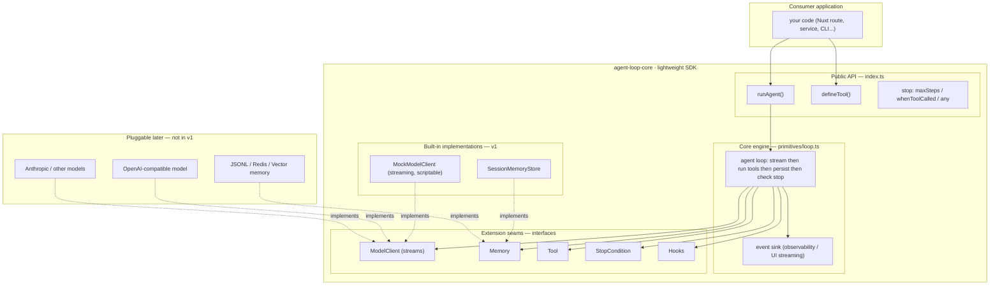
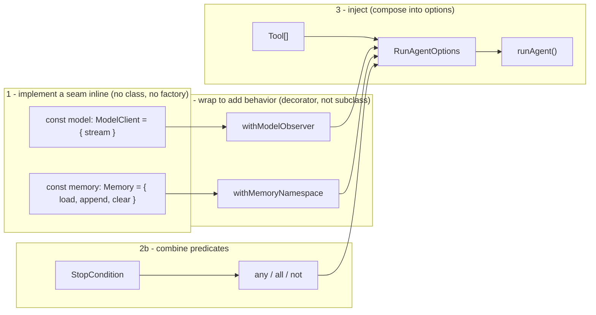
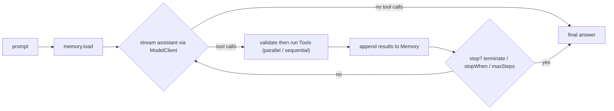
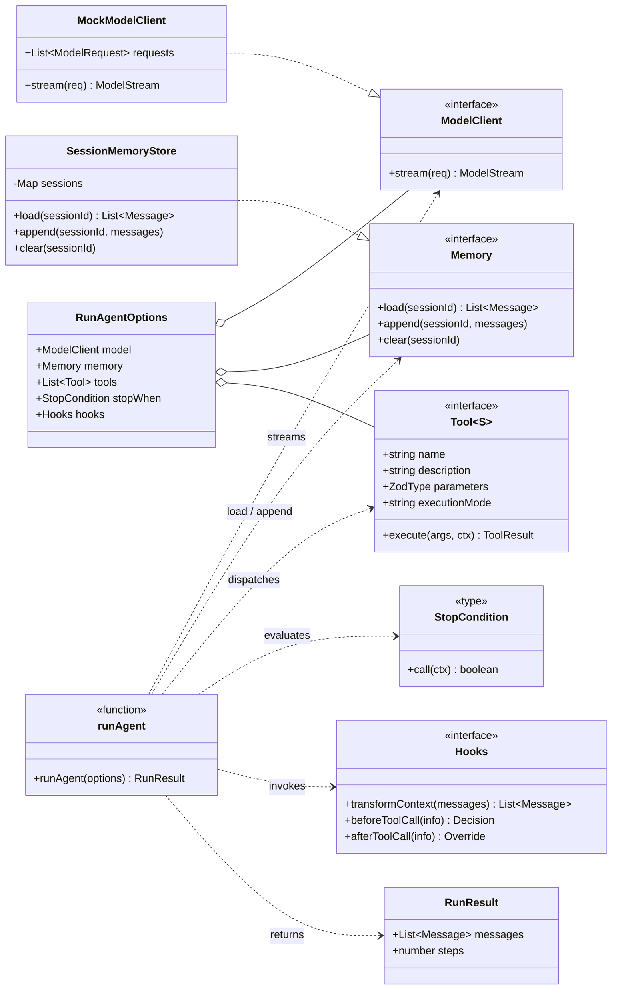

# agent-loop-core — architecture

A **lightweight agent SDK**. The design is one thin core engine (`runAgent`)
that depends only on a small set of **extension seams** (interfaces). Built-in
implementations satisfy those seams; consumers plug in their own. Nothing in the
core is bound to a specific LLM provider or storage.

> The Mermaid below renders on GitHub and is the source of truth. For an
> **interactive, node-based** version, run the docs app (`npm run dev`) and open
> [`/architecture`](http://localhost:3000/architecture) — built with Vue Flow.

## SDK architecture (layered)

**Reading it:** the core engine only ever calls the **interfaces** in the seams
layer. v1 ships `MockModelClient` + `SessionMemoryStore`; future providers/stores are
just new implementations of the same seams — the core never changes.

## Composition over inheritance

There is **no inheritance** in the SDK — no `extends`, no `super`, no abstract
base classes. You add capability by **building**, **wrapping**, and **injecting**
plain functions/objects, never by subclassing.

- **Implement** — a seam is just an object/function that satisfies the
  interface (`{ stream }`, `{ load, append, clear }`). No base class, no factory
  wrapper. (`defineTool` is the one helper kept — purely so TypeScript infers
  the Zod schema into `execute`'s args, the same role as `defineConfig`.)
- **Wrap** — decorators like `withModelObserver` / `withMemoryNamespace` add
  behavior by *enclosing* an existing seam and forwarding to it. Want logging +
  namespacing? Wrap twice. (Classes such as `MockModelClient` implement an
  interface — `..|>` — but extend nothing.)
- **Combine** — stop conditions compose with `any` / `all` / `not`.
- **Inject** — everything meets at `RunAgentOptions`, the single composition
  point handed to `runAgent`.

## Runtime flow

## Type/OOP detail (class diagram)

