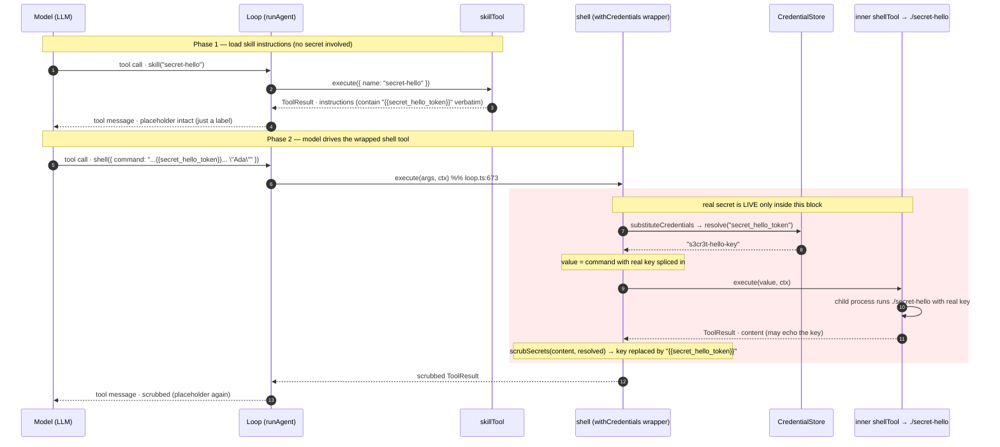

# Credential flow: skill + `withCredentials`

How a secret reaches the shell without the model ever seeing its value, using the
`secret-hello-skill` example. There are two phases: loading the skill
instructions (no secret involved), then the credential-bearing shell tool call
(where the real secret is briefly live).

## Sequence diagram

## What the diagram shows

- **`skillTool` (steps 2–4)** only ever moves the placeholder *name* around — it
  touches the conversation, never the value. The skill is pure instructions; it
  is not wrapped with `withCredentials`.
- **The red block (steps 7–11)** is the *only* place the real secret exists,
  bounded by `substituteCredentials` on the way in and `scrubSecrets` on the way
  out, both inside the `withCredentials` wrapper.
- **Everything crossing the Model lifeline** — steps 1, 4, 5, 12 — carries
  placeholders only.

## The mental separation that matters

| Component | Role | Sees the real value? |
| --- | --- | --- |
| **Skill** (instructions) | Carries the placeholder *name* into the conversation | No |
| **`withCredentials`** (on the shell tool) | Materializes the real value for exactly one `execute` call | Yes — briefly |
| **Inner shell tool / binary** | Runs the command with the real value spliced in | Yes — at exec time |
| **Model** | Reads/writes placeholders on both ends | No |

The skill could be anything — it just has to tell the model which placeholder
name to use. The credential machinery lives entirely on the tool, not the skill.
That's why the same `shell` tool, wrapped once, works for any skill that
references `{{secret_hello_token}}`.
