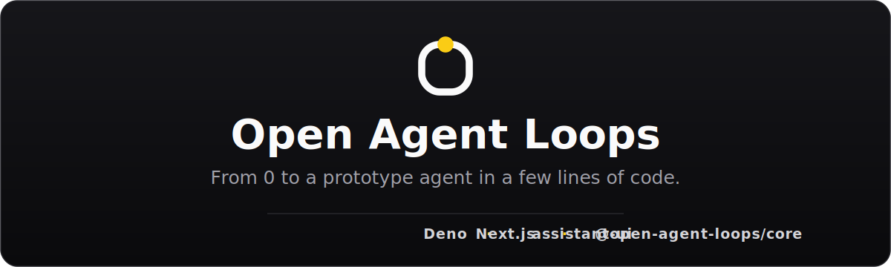

<a href="../../README.md">
  
</a>

<p align="center">
  <a href="../../README.md">Open Agent Loops</a> ·
  <a href="#architecture--one-app-one-runtime">Architecture</a> ·
  <a href="#batteries-on-the-menu">Batteries</a> ·
  <a href="#run-it">Run it</a> ·
  <a href="https://www.assistant-ui.com/">assistant-ui</a> ·
  <a href="https://deno.com/">Deno</a> ·
  <a href="https://discord.gg/NF77tmxcyR">Discord</a>
</p>

<p align="center">
  <!-- npm badges — enable once @open-agent-loops/core is published to npm:
  <a href="https://www.npmjs.com/package/@open-agent-loops/core"></a>
  <a href="https://www.npmjs.com/package/@open-agent-loops/core"></a>
  -->
  
  
  
  
  
  
  <a href="https://discord.gg/NF77tmxcyR"></a>
</p>

<p align="center">
  <b>From 0 to a prototype agent in a few lines of code — every <code>@open-agent-loops/core</code> battery, on an assistant-ui chat UI, run on Deno. 🧰⚡</b>
</p>

One agent, wired with every `@open-agent-loops/core` battery that composes
cleanly, fronted by an [assistant-ui](https://www.assistant-ui.com/) chat UI in a
**Next.js** app, all run on **Deno**. It's the capstone example: a tour of how the
seams stack on top of `runAgent` without the loop ever changing.

## Architecture — one app, one runtime

There is **no separate backend server**. Deno runs the whole Next.js app; the
agent lives in a same-origin route handler:

```
┌─ Deno  (the runtime/engine — one process) ─────────────────────┐
│  └── Next.js  (the framework Deno runs)                         │
│      ├── Frontend  → assistant-ui chat UI (React) → browser     │
│      │              app/page.tsx + components/assistant-ui/*    │
│      └── Backend   → app/api/assistant/route.ts  (TypeScript)   │
│                       └── runAgent + every battery (lib/agent)  │
└──────────────────────────────────────────────────────────────────┘
```

A message round-trip: the UI POSTs an assistant-transport *command* to
`/api/assistant`; the route runs the agent; [`lib/bridge/assistant-transport.ts`](lib/bridge/assistant-transport.ts)
folds the agent's `AgentEvent` stream into one assistant message (reasoning /
tool-call / text parts) and streams it back as `update-state` ops; the thin
converter in [`app/MyRuntimeProvider.tsx`](app/MyRuntimeProvider.tsx) renders it.

## Batteries on the menu

Every one is wired in [`lib/agent.ts`](lib/agent.ts):

| Battery | Where |
|---|---|
| Model + reasoning kwargs | `OpenAICompatibleModel({ thinking: "on" })` |
| Model decorator | `withModelObserver` (stream-error logging) |
| Observability | `Tracer` → `onRawRequest`/`onRequest` |
| Memory + decorator | `SessionMemoryStore` + `withMemoryListeners` (per `threadId`) |
| Steering / follow-up | `MessageQueue` + `hooks.drainSteering` / `drainFollowUp` — inject into a live run (`POST /api/assistant/steer`) |
| Built-in tools | `shellTool` + `searchTool` on real **node backends** (`node:child_process`) |
| Planning tools | `todoListTools` + `scratchpadTools` |
| Credentials | `withCredentials` — secret spliced in per call, scrubbed from output |
| Multi-agent | `agentAsTool` — a context-isolated `researcher` sub-agent |
| Skills | `SkillRegistry` + `skillTool` (the `deep_research` skill) |
| Permissions | `permissionGate` — read-only/planning auto-allowed, else auto-approve (v1) |
| Stop conditions | `maxSteps` cap **and** `any(whenToolCalled("finish"))` |
| The bridge | [`lib/bridge/assistant-transport.ts`](lib/bridge/assistant-transport.ts) — `AgentEvent` → assistant-ui state |

## Run it

```bash
cd examples/kitchen-sink-web
deno task dev          # Deno runs Next.js → http://localhost:3000
```

- **No API key?** The agent route runs a scripted **mock model** automatically, so
  the stream works immediately (it calls the `shell` tool once, then answers).
- **Real model:** copy `.env.local.example` → `.env.local` and set `LLM_API_KEY` +
  `LLM_MODEL` (any OpenAI-compatible endpoint), then `deno task dev`.

Browser-free smoke check (drives the agent + the generic snapshot bridge
in-process, asserts the run, exits non-zero on failure):

```bash
deno run -A examples/kitchen-sink-web/smoke.ts
```

## Steering & follow-up (inject into a live run)

The loop never owns input — it only *pulls* at its boundaries. Two per-session
`MessageQueue`s (keyed by `threadId`, on the shared assistant in
[`lib/assistant-instance.ts`](lib/assistant-instance.ts)) feed those pulls:

- **Steering** — `hooks.drainSteering`, drained after each turn's tool results,
  redirects a run even past a tool's `terminate` or a `stopWhen`.
- **Follow-up** — `hooks.drainFollowUp`, drained only when the run would stop at a
  natural final answer, continuing it in place (one trace, monotonic steps).

While a run is in flight, push to either queue with the steer route:

```bash
curl -s -X POST http://localhost:3000/api/assistant/steer \
  -H 'content-type: application/json' \
  -d '{"threadId":"ID","text":"actually, also check the README","kind":"steering"}'
```

Headless check (drives both seams through `steer()` / `followUp()` on the mock,
asserts each queued message is injected, exits non-zero on failure):

```bash
deno run -A examples/kitchen-sink-web/smoke-steering.ts
```

## Cancellation

The chat route forwards the request's `AbortSignal` into `runAgent`, so a client
disconnect/cancel aborts the model **and** kills in-flight tool subprocesses (the
core threads `signal` to every `tool.execute` ctx; the node backends pass it to
`spawn`). The transport swallows the resulting `AbortError` (the client is gone)
and surfaces any other error in the assistant bubble instead of crashing the
stream.

## Thread list

The left sidebar ([`components/assistant-ui/thread-list.tsx`](components/assistant-ui/thread-list.tsx),
from the assistant-ui registry) is a real thread list: New Thread, history,
rename/archive. `useAssistantTransportRuntime` is built on a thread-list adapter,
so **each thread is its own server `sessionId`** — the agent's per-session memory
never bleeds across threads.

## What's verified

- ✅ **Runs on Deno** (2.6.7): `deno task dev` boots Next.js 16 / React 19 /
  Tailwind 4; `GET /` renders the full Thread + thread-list sidebar.
- ✅ **Agent round-trip on Deno**: `POST /api/assistant` streams reasoning, a
  **real tool execution** (the `shell` tool runs via `node:child_process`), and the
  answer, as assistant-transport `update-state` frames. Works with zero API key.

## Notes

- **One runtime.** `node:child_process` (in the tool backends) and Next.js are
  Node-*ecosystem* pieces, but **Deno runs all of it** via its node-compat layer —
  there is no separate Node process. Kept portable on purpose; swap to
  `Deno.Command` if you want it Deno-only.
- **Turbopack cache.** Don't interleave `npm run dev` (Node) and `deno task dev`
  (Deno) against the same `.next/` — their Turbopack caches aren't compatible and
  the second one panics. Pick one runtime (Deno) and delete `.next/` if you
  switched.
- **Permissions in a web UI.** v1 auto-approves "ask" calls and logs the decision.
  The real human-in-the-loop flow surfaces the pending call as a `requires-action`
  tool UI and round-trips an `add-tool-result` command — a good next exercise.

## License

MIT — see [`LICENSE`](../../LICENSE). Part of the
[Open Agent Loops](../../README.md) project.
